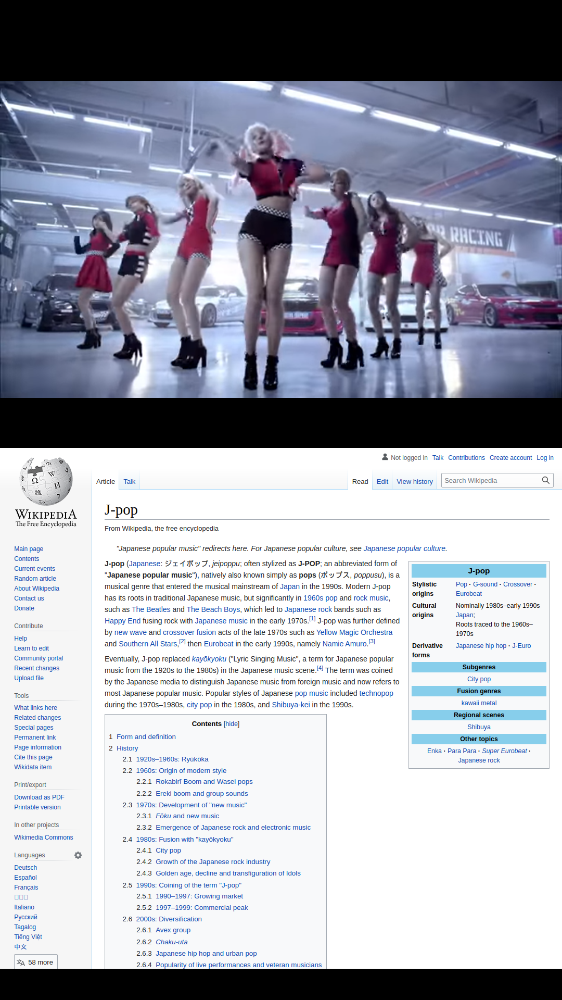
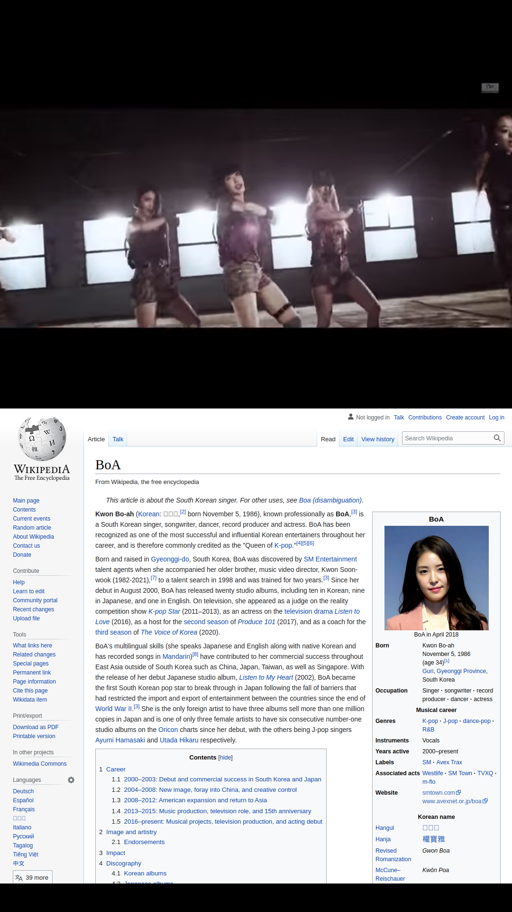
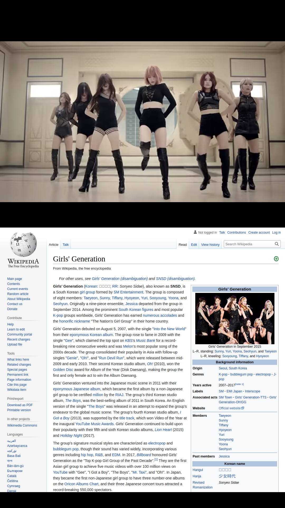

# MMM-YouTubeWebView: A YouTube WebView module for [MagicMirror²](https://github.com/MichMich/MagicMirror)

This is a module for the [MagicMirror²](https://github.com/MichMich/MagicMirror/).
MMM-YouTubeWebView allows you to add a webview which can display YouTube urls.

This module uses the [Electron's \<webview\> tag](https://www.electronjs.org/docs/api/webview-tag) instead of `<iframe>` to embed pages. It enables display of YouTube videos that cannot be displayed in an `<iframe>`.

v1.0.0

## Table of contents

1. [Technical Overview](#technical-overview)
1. [Features](#features)
1. [Installation](#installation)
1. [Using this module](#using-this-module)
1. [Configuration](#configuration)
    1. [Optional configuration](#optional-configuration)
    1. [Example configurations](#example-configurations)
1. [Update](#update)
1. [Limitations](#limitations)
1. [Motivation](#motivation)
1. [Screenshots](#screenshots)
1. [Support](#support)
1. [License](#license)

## Technical Overview

The webview tag is used to embed 'guest' content in the MagicMirror Electron app.
The guest content is contained within the webview container. An embedded page within
MagicMirror controls how the guest content is laid out and rendered.

Unlike an iframe, the webview runs in a separate process than MagicMirror.
It doesn't have the same permissions and all interactions between MagicMirror
and embedded content will be asynchronous. This keeps MagicMirror safe from the
embedded content.

Under the hood webview is implemented with Out-of-Process iframes (OOPIFs).
The webview tag is essentially a custom element using shadow DOM to wrap an
iframe element inside it. So the behavior of webview is very similar to a
cross-domain iframe. As such, it can be used to safely avoid cross-domain
policy restrictions that may prevent access to web content.

### Features

- Embedded YouTube Player on MagicMirror with Autoplay
- Specify a single YouTube video ID, a list of video IDs, or a playlist ID
- Loop after playing specified list or playlist
- Optionally execute specified JavaScript after loading the webview 
- Optionally specify an HTTP referrer to avoid YouTube blocking video access 

## Installation

Clone this repository in your `modules` folder:

```bash
cd ~/MagicMirror/modules
git clone https://gitlab.com/doctorfree/MMM-YouTubeWebView.git
cd MMM-YouTubeWebView
npm install
```

## Using this module

Customize the following configuration block and add it to the modules array in the `config/config.js` file:

```js
modules: [
  {
    module: 'MMM-YouTubeWebView',
    position: 'bottom_bar', // This can be any of the regions.
    config: {
      // See 'Configuration options' in README.md for more information.
      video_id: "gmW4TqOybzA", // These are sample YouTube video IDs
      video_list: [
          "CtVyl402W5s", // They are all videos by Rufus Wainwright
          "wmUVy43tqw4",
          "J_TxPQKcG7w", // Replace these with IDs of your own choosing
          "avWZsKyuRVE",
          "IpkIGGJMHBA", // They need to be publicly accessible videos
          "B9zgwx6mhrk",
          "6KvTDeHlIfI"
      ],
      autoplay: true,
      controls: false,
      loop: true,
      modestbranding: true,
      width: "800px", // Can be a percentage, e.g. 100%
      height: "450px",
      referrer: "http://your.public.domain.org", // Needed when YouTube will not play video
    },
  },
]
```

Finally, add the following configuration block to `config/config.js` file. This is required to run this module correctly.

```js
  electronOptions: {
    webPreferences: {
      webviewTag: true,
      contextIsolation: false,
      enableRemoteModule: true
    },
  },
```

## Configuration

The following properties are required for configuration:

| Config     | Description                                                                                                                                                |
| ---------- | ---------------------------------------------------------------------------------------------------------------------------------------------------------- |
| `video_id` | YouTube video id to display. You can get it from youtube url <br> **Example:** `https://www.youtube.com/watch?v=w3jLJU7DT5E` <br>**video_id:** w3jLJU7DT5E |

### Optional configuration

The following properties can be configured:

| Option           | Description     | Default Value | Type Data |
| ---------------- | ---------------------------------------------------------------------------------------------------------------------------------------------------------------------------------------------- | ------------- | --------- |
| `autoplay`       | Autoplay video when it loaded  | `false`       | Boolean   |
| `color`          | Player's video progress bar to highlight the amount of the video that the viewer has already seen but color can be only `red` or `white`                                                       | `"red"`       | String    |
| `controls`       | Show youtube video controls bar   | `true`        | Boolean   |
| `disablekb`      | Disable keyboard control  | `false`       | Boolean   |
| `fs`             | Displaying fullscreen button in player  | `true`        | Boolean   |
| `loadedJS` | the JavaScript code string to be executed after page load | `undefined` | String |
| `loop`           | Auto-play video again   | `false`       | Boolean   |
| `modestbranding` | Prevent the YouTube logo displaying in the controlbar. But YouTube text label still display in the upper-right cornner of a paused video when the user's mouse pointer hovers over the player. | `false`       | Boolean   |
| `referrer`            | HTTP Referrer, used to avoid YouTube policy that sometimes disables display of video to unknown or local referrer.  | ""       | String   |
| `rel`            | Show related video at the end of video | `false`       | Boolean   |
| `showinfo`       | Show video title and uploader | `false`       | Boolean   |
| `video_list`     | Play video from list by video id. YouTube will play `video_id` first then play video from `video_list`. See [Example in Wiki](https://gitlab.com/doctorfree/MMM-YouTubeWebView/-/wikis/Custom-Playlist) | []            | Array     |
| `playlist`       | Play video from playlist by playlist id. **Note** It will neither play video from `video_id` nor `video_list`. See [Example in Wiki](https://gitlab.com/doctorfree/MMM-YouTubeWebView/-/wikis/Korean-Pop)  | ""            | String    |
| `width`          | Video width  | "560px"         | String   |
| `height`         | Video height | "315px"         | String   |

### Example configurations

Several example configurations utilizing the MMM-YouTubeWebView module are available.

- [Fractals](https://gitlab.com/doctorfree/MMM-YouTubeWebView/-/wikis/Fractal-Playlist)
- [Korean Pop](https://gitlab.com/doctorfree/MMM-YouTubeWebView/-/wikis/Korean-Pop)
- [Rufus Wainwright](https://gitlab.com/doctorfree/MMM-YouTubeWebView/-/wikis/Rufus-Wainwright)

In addition to these MMM-YouTubeWebView example configs, an extensive library of
MagicMirror configuration files is maintained in the
[MirrorCommandLine repository](https://gitlab.com/doctorfree/MirrorCommandLine).

## Update

Get the latest version using the command `git pull`:

```bash
cd ~/MagicMirror/modules/MMM-YouTubeWebView
git pull
npm install
```

## Limitations

Electron's webview tag is based on Chromium's webview, which is undergoing
architectural changes. This impacts the stability of webviews, including
rendering, navigation, and event routing.

You can not add keyboard, mouse, and scroll event listeners to webview.

## Motivation

When embedding YouTube videos in MagicMirror, some videos cannot be embedded using an iframe. There are several reasons, one of these is the HTTP response header `X-Frame-Options: DENY` by the website disables iframe. This is needed for security.

For MagicMirror usage, using WebView instead of iframe may resolve the problem.

Further, The excellent MMM-WebView module by Shunta Iketaki only handles a single URL. I wanted my MagicMirror to cycle through multiple YouTube videos and/or a playlist. I combined some of the features from the MMM-EmbedYoutube module by Nitipoom Unrrom with the functionality of MMM-WebView, adding some additional features.

## Screenshots

<p float="left">
  
  
  
</p>

## Support

Issues with MMM-YouTubeWebView can be reported and tracked in the Issues section of the repository at https://gitlab.com/doctorfree/MMM-YouTubeWebView/-/issues

## License

MIT Copyright (c) 2021 Ronald Joe Record
